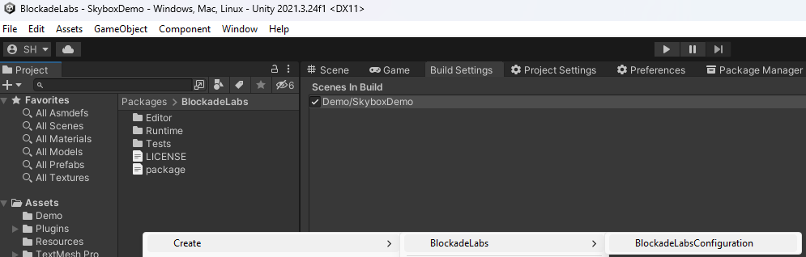

# com.rest.blockadelabs

[](https://discord.gg/xQgMW9ufN4) [](https://openupm.com/packages/com.rest.blockadelabs/) [](https://openupm.com/packages/com.rest.blockadelabs/)

A non-official [BlockadeLabs](https://www.blockadelabs.com/) Skybox AI RESTful client for the [Unity](https://unity.com/) Game Engine.

I am not affiliated with BlockadeLabs and an account with api access is required.

***All copyrights, trademarks, logos, and assets are the property of their respective owners.***

## Installing

Requires Unity 2021.3 LTS or higher.

The recommended installation method is though the unity package manager and [OpenUPM](https://openupm.com/packages/com.rest.blockadelabs).

### Via Unity Package Manager and OpenUPM

- Open your Unity project settings
- Select the `Package Manager`

- Add the OpenUPM package registry:
  - Name: `OpenUPM`
  - URL: `https://package.openupm.com`
  - Scope(s):
    - `com.rest.blockadelabs`
    - `com.utilities`
- Open the Unity Package Manager window
- Change the Registry from Unity to `My Registries`
- Add the `BlockadeLabs` package

### Via Unity Package Manager and Git url

- Open your Unity Package Manager
- Add package from git url: `https://github.com/RageAgainstThePixel/com.rest.blockadelabs.git#upm`
  > Note: this repo has dependencies on other repositories! You are responsible for adding these on your own.
  - [com.utilities.async](https://github.com/RageAgainstThePixel/com.utilities.async)
  - [com.utilities.extensions](https://github.com/RageAgainstThePixel/com.utilities.extensions)
  - [com.utilities.rest](https://github.com/RageAgainstThePixel/com.utilities.rest)

## Documentation

### Table of Contents

- [Authentication](#authentication)
- [Skyboxes](#skyboxes)
  - [Get Skybox Styles](#get-skybox-styles)
  - [Generate Skybox](#generate-skybox)
  - [Get Skybox by Id](#get-skybox)
  - [Delete Skybox by Id](#delete-skybox)
  - [Get Skybox History](#get-skybox-history)
  - [Cancel Skybox Generation](#cancel-skybox-generation)
  - [Cancel All Pending Skybox Generations](#cancel-all-pending-skybox-generations)

### Authentication

There are 4 ways to provide your API keys, in order of precedence:

1. [Pass keys directly with constructor](#pass-keys-directly-with-constructor)
2. [Unity Scriptable Object](#unity-scriptable-object)
3. [Load key from configuration file](#load-key-from-configuration-file)
4. [Use System Environment Variables](#use-system-environment-variables)

#### Pass keys directly with constructor

```csharp
var api = new BlockadeLabsClient("yourApiKey");
```

Or create a `BlockadeLabsAuthentication` object manually

```csharp
var api = new BlockadeLabsClient(new BlockadeLabsAuthentication("yourApiKey"));
```

#### Unity Scriptable Object

You can save the key directly into a scriptable object that is located in the `Assets/Resources` folder.

You can create a new one by using the context menu of the project pane and creating a new `BlockadeLabsConfiguration` scriptable object.



#### Load key from configuration file

Attempts to load api keys from a configuration file, by default `.blockadelabs` in the current directory, optionally traversing up the directory tree or in the user's home directory.

To create a configuration file, create a new text file named `.blockadelabs` and containing the line:

##### Json format

```json
{
  "apiKey": "yourApiKey",
}
```

You can also load the file directly with known path by calling a static method in Authentication:

```csharp
var api = new BlockadeLabsClient(BlockadeLabsAuthentication.Default.LoadFromDirectory("your/path/to/.blockadelabs"));;
```

#### Use System Environment Variables

Use your system's environment variables specify an api key to use.

- Use `BLOCKADE_LABS_API_KEY` for your api key.

```csharp
var api = new BlockadeLabsClient(BlockadeLabsAuthentication.Default.LoadFromEnvironment());
```

### Skyboxes

#### [Get Skybox Styles](https://api-documentation.blockadelabs.com/api/skybox.html#get-skybox-styles)

Returns the list of predefined styles that can influence the overall aesthetic of your skybox generation.

```csharp
var api = new BlockadeLabsClient();
var skyboxStyles = await api.SkyboxEndpoint.GetSkyboxStylesAsync();

foreach (var skyboxStyle in skyboxStyles)
{
    Debug.Log($"{skyboxStyle.Name}");
}
```

#### [Generate Skybox](https://api-documentation.blockadelabs.com/api/skybox.html#generate-skybox)

Generate a skybox.

```csharp
var api = new BlockadeLabsClient();
var request = new SkyboxRequest("mars", depth: true);
var skyboxInfo = await api.SkyboxEndpoint.GenerateSkyboxAsync(request);
skyboxMaterial.mainTexture = skyboxInfo.MainTexture;
skyboxMaterial.depthTexture = skyboxInfo.DepthTexture;
```

#### [Get Skybox](https://api-documentation.blockadelabs.com/api/skybox.html#get-skybox-by-id)

Returns the skybox metadata for the given skybox id.

```csharp
var skyboxId = 42;
var skyboxInfo = await api.SkyboxEndpoint.GetSkyboxInfoAsync(skyboxId);
Debug.Log($"Skybox: {result.Id} | {result.MainTextureUrl}");
// Note: If you wish to use the returned skybox textures you'll need to additionally call await SkyboxInfo.LoadTexturesAsync(); before you can assign them to a material property.
await skyboxInfo.LoadTexturesAsync();
skyboxMaterial.mainTexture = skyboxInfo.MainTexture;
skyboxMaterial.depthTexture = skyboxInfo.DepthTexture;
```

#### [Delete Skybox](https://api-documentation.blockadelabs.com/api/skybox.html#delete)

Deletes a skybox by id.

```csharp
var skyboxId = 42;
var result = await api.SkyboxEndpoint.DeleteSkyboxAsync(skybox);
// result == true
```

#### [Get Skybox History](https://api-documentation.blockadelabs.com/api/skybox.html#get-history)

Gets the previously generated skyboxes.

```csharp
var history = await api.SkyboxEndpoint.GetSkyboxHistoryAsync();
Debug.Log($"Found {history.TotalCount} skyboxes");

foreach (var skybox in history.Skyboxes)
{
    Debug.Log($"{skybox.Id} {skybox.Title} status: {skybox.Status}");
}
```

#### [Cancel Skybox Generation](https://api-documentation.blockadelabs.com/api/skybox.html#cancel-generation)

Cancels a pending skybox generation request by id.

```csharp
var skyboxId = 42;
var result = await CancelSkyboxGenerationAsync(skyboxId);
// result == true
```

> Note: This is automatically done when cancelling a skybox generation using cancellation token.

#### [Cancel All Pending Skybox Generations](https://api-documentation.blockadelabs.com/api/skybox.html#cancel-all-pending-generations)

Cancels ALL pending skybox generation requests.

```csharp
var result = await api.SkyboxEndpoint.CancelAllPendingSkyboxGenerationsAsync();
Debug.Log(result ? "All pending generations successfully cancelled" : "No pending generations");
```
